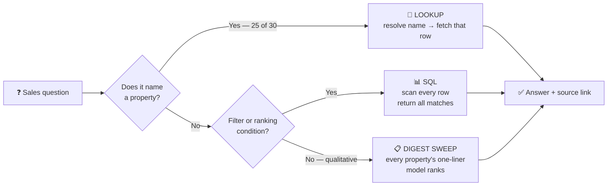
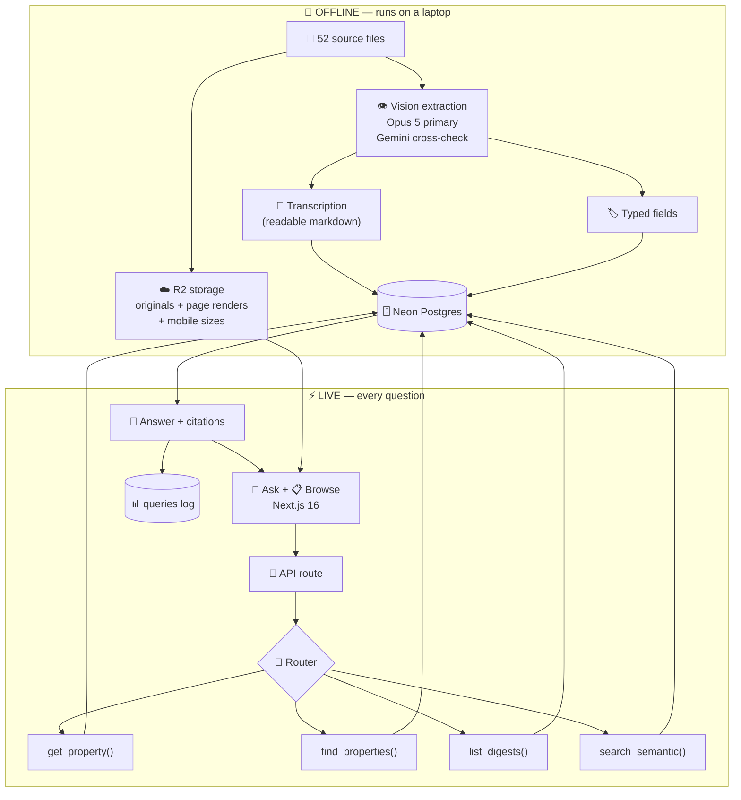
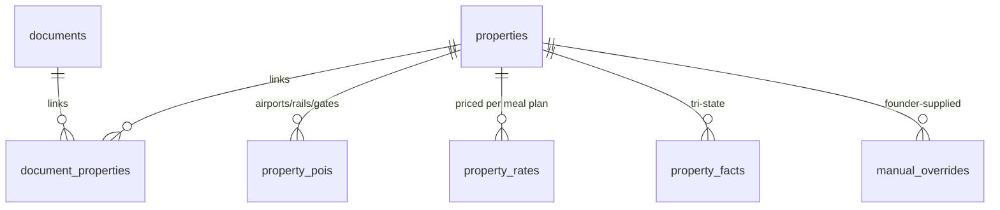
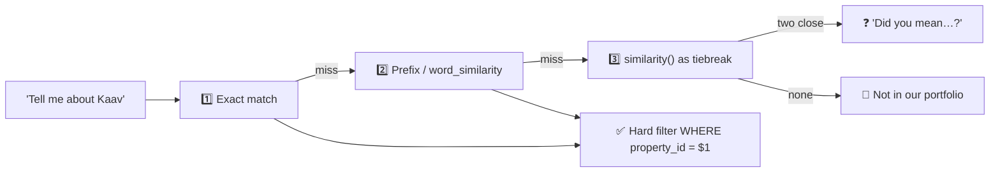
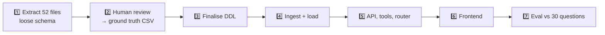

# 🏗️ Travel Inn Sales Assistant — Complete Architecture

**Version 2 · 3 Sep 2026**
Researched with 37 agents across 9 dimensions, adversarially challenged, then independently reviewed. **This version incorporates the review** — 8 blockers and 14 major issues fixed. Changes from v1 are marked 🔄.

---

## 📖 Part 1 — What we are building, in plain words

Travel Inn's sales team sells Indian wildlife and heritage properties to foreign tour operators. To quote a trip they need facts: how far is the airport, how many rooms, what does it cost, is it good for birders.

Today those facts live in 52 design files in a SharePoint folder. Sales either clicks through folders or messages the founder.

**We are building a web page where they type a question and get an answer, with a link to the exact document it came from.**

Everything below is how we make that answer *correct*, *fast*, and *trustworthy*.

---

## 💡 Part 2 — The insight that shapes the design

The instinct is "it's a RAG chatbot, so embed everything and do vector search." **That is wrong for this project.**

We analysed the client's own 30-question acceptance test:

| Question type | Count | Example | What it really is |
|---|---|---|---|
| **[P] Names a property** | **25 of 30** | *"What is the nearest airport to Bagh Tola?"* | A **lookup** — find one row, read it |
| **[C] Searches the corpus** | **5 of 30** | *"Which properties have fewer than 20 rooms?"* | A **filter** — scan every row |

**Neither is semantic search.**

- A lookup needs the *right property*, exactly. Ranking by similarity is the wrong tool.
- A filter needs *all* matching rows. Vector search returns the top 5 and stops. It cannot know it missed 12.



🔄 **Changed in v2:** there is now a **fourth path**. Two acceptance questions — *"which properties are good for families?"* and *"which have the strongest conservation programmes?"* — name no property and have no numeric filter. In v1 they fell to vector search, which returns top-5 of 49. If the head of sales knows a sixth, that is the exact trust-ending moment we exist to prevent. The digest sweep returns **every** property's one-line summary (~5k tokens) and lets the model rank the full set.

**So: this is a database application with a language interface.** Vector search is a rarely-used fallback, not the engine.

---

## 🗺️ Part 3 — The big picture



---

## 🧱 Part 4 — Layer by layer

### 🔧 Layer 1 — Ingestion

**Job:** turn 52 design files into clean database rows.

**Five rules:**

| # | Rule | Why |
|---|---|---|
| 1️⃣ | **Slice tall images, never shrink them** | Every PNG is 794px wide at 96 DPI. "Upscale 2× then cap at 4096px" scales *both* dimensions down — the tallest file ends up **631px wide, narrower than the original**. Slicing loses zero pixels |
| 2️⃣ 🔄 | **For PDFs, just send the PDF** | **Changed in v2.** Both Claude and Gemini already convert each page to an image *and* extract the text layer, passing both to the model. My hand-built dual-input was rebuilding something the API does for free. We still render pages to PNG separately — but only for the source viewer |
| 3️⃣ | **One call returns TWO things** — transcription *and* typed fields | The transcription is the durable asset. Schema changes re-derive fields from stored text instead of re-running vision |
| 4️⃣ | **Cross-check with a different model family** | Extraction errors are permanent. Two runs of the *same* model make the same mistake twice — agreement proves nothing. The human review is ground truth; the diff just tells the human where to look first |
| 5️⃣ | **Deduplicate by content hash** | Ramathra Fort exists twice with identical SHA1 |

🔄 **New rule 6 — split group documents.** Two files are *group sheets*: the Oberoi PNG covers 8 hotels, the Postcard PDF covers about 12. Ingestion must split one file into many property links. Verified: the Postcard PDF names Chicalim, Chitwan, Gir, Jawai, Kanha, Leh, Mandalay Hall, Durrung Tea Estate, Himalayas, Arabian Sea, Mandovi River, Goa.

**Before locking extraction:** run three files (include the Vayal Veedu JPEG — the only real quality risk — and the tallest PNG at 794×5150) at native and at 2× strip resolution, score against hand-read values. Half a day, and it produces the first rows of ground truth.

---

### 🗄️ Layer 2 — The database

🔄 **Substantially rewritten in v2.** The v1 diagram promised things the schema could not deliver.

**Three problems the review found:**

| Promised in prose | Delivered in schema | Consequence |
|---|---|---|
| Tri-state facts | `staff_inspected BOOLEAN` | "Not inspected" and "not mentioned" become the same thing |
| "Airports and rates get their own tables" | Only airports | A ₹9,250 room-only rate compares against a ₹47,000 all-inclusive rate |
| One document ↔ one property | `documents ||--o{ properties` | Oberoi Rajgarh has **two** documents; the Postcard PDF has **twelve** properties. Unrepresentable |



```sql
create table documents (
  sha256          text primary key,
  r2_key          text not null,
  title           text,
  template        text,   -- png_2025 | png_2024 | pdf_numbered | one_off | group_update
  doc_date        date,   -- printed sheet date; NULL renders as "undated source"
  superseded_by   text references documents(sha256),
  transcription   text not null,
  raw_fields      jsonb,
  extractor_model text, prompt_version text, schema_version text
);

create table properties (
  id                serial primary key,
  canonical_name    text unique not null,
  aliases           text[] not null default '{}',
  state text, folder_path text, park text,
  group_affiliation text,          -- Taj/IHCL, Oberoi, Postcard — Ravi named this a quoting parameter
  room_count int, best_time text,
  ideal_for text[], tags text[],   -- families, birders, conservation, wellness…
  digest    text,                  -- one line, powers the digest sweep
  card_type text                   -- property | group_update
);

create table document_properties (   -- 🔄 many-to-many, the v1 blocker
  document_sha text references documents(sha256),
  property_id  int  references properties(id),
  primary key (document_sha, property_id)
);

create table property_pois (         -- 🔄 airports, railheads AND gates
  property_id int, kind text check (kind in ('airport','railhead','gate')),
  name text, km numeric, minutes int, document_sha text
);

create table property_rates (        -- 🔄 was missing entirely
  property_id int, amount_inr int, meal_plan text, basis text,
  category text, season text, document_sha text
);

create table property_facts (        -- 🔄 tri-state, never a bare boolean
  property_id int, key text,         -- pool, spa, wifi, staff_inspected…
  asserted_as text check (asserted_as in ('stated','negated','absent','room_scoped','hedged')),
  value text, evidence text, source_section text, document_sha text,
  primary key (property_id, key, document_sha)
);

create table manual_overrides (      -- 🔄 star ratings and anything the sheets lack
  property_id int, key text, value text, set_by text, set_at timestamptz default now()
);

create table queries (               -- 🔄 promised in the scoping doc, missing from v1
  id bigserial primary key, ts timestamptz default now(),
  question text, tool text, args jsonb, property_ids int[],
  answer text, latency_ms int, thumb smallint
);

create table card_embeddings (       -- one row per card, not per section
  property_id int, document_sha text, embedding halfvec(1536)
);
```

#### ⚖️ Why tri-state matters (the subtlest idea here)

If `has_pool = false`, what does it mean?

| Real situation | Naive boolean | Correct |
|---|---|---|
| *"No swimming pool"* — Agoratoli | `false` ❌ | **negated** — we know there is none |
| *"Outdoor swimming pool 4.5 ft"* | `true` ✅ | **stated** |
| The PDF template has no amenities section | `false` ❌❌ | **absent** — we don't know |
| *"Plunge Pool Suites"* (a room name) | `true` ⚠️ | **room_scoped** |
| *"website does not promote a pool"* | `false` ⚠️ | **hedged** |

A boolean turns "we don't know" into "no" — a confidently wrong answer. So every filter answer reports three numbers:

> *"Checked all 51 properties. **9** list a pool. **6** state they have none. **36** don't mention it either way."*

🔄 **The count is computed from the table, never hard-coded.** With group sheets split out there are ~65–70 named properties, not 49 — so "Checked all 49" was simply untrue.

---

### 🧭 Layer 3 — The router

Claude gets four typed tools. It never writes SQL — it fills in parameters we compile into a safe query.

```ts
get_property({ names: CanonicalName[] })      // 🔄 array, so "compare A and B" works
  // returns row + pois[] + rates[] + facts[] + transcription + documents[] with doc_date

find_properties({
  state?, park?, room_count_lt?, room_count_gte?,
  fact?: { key, asserted_as: 'stated' | 'negated' },
  ideal_for?: string[], tags?: string[],
  price_max_inr?, meal_plan?,                  // 🔄 price needs a meal plan, or returns the code per row
  sort_by?: 'airport_km' | 'gate_km' | 'railhead_km' | 'room_count' | 'price',
  limit?
})
  // returns { matched_count, rows[], counts: {stated, negated, absent}, truncated }
  // 🔄 ranking uses ORDER BY MIN(km) over property_pois — not a flat column

list_digests({ question })                     // 🔄 NEW — every property's one-liner, for qualitative sweeps
search_semantic({ query, property_id? })       // fallback only
```

Every tool uses `strict: true`, and `names` is an **enum of the 49 canonical names**, so the model physically cannot emit a property that doesn't exist.

**Why tools and not model-written SQL:** typed parameters cannot invent a column name.

**Why the property list is NOT in the cached prompt:** it creates two sources of truth, and the model answers from the stale copy instead of calling the tool. The digest sweep is different — it is a *fresh read from the same database* on every call, not a cached duplicate.

---

### 🎯 Layer 4 — Property resolution

🔄 **Rewritten in v2. My v1 examples were wrong.**

I claimed "Bagh Tola and Haldu Tola are one letter apart." The review computed actual trigram similarity:

| Pair | Similarity | Verdict |
|---|---|---|
| Bagh Tola vs Haldu Tola | 0.31 | Above 0.30 threshold — barely, but they don't collide |
| Kathoni vs Kaav | 0.08 | Nowhere near |
| Postcard Leh vs Dolkhar | 0.04 | A location coincidence, not a name one |
| **"Kaav" vs "Kaav Safari Lodge"** | **0.28** | ❌ **below threshold — fails to resolve** |
| **"Postcard Leh" vs "The Postcard in the Himalayan Willows"** | **0.24** | ❌ **fails** |

**So the real failure is the opposite of what I described.** Full names don't collide. **Short forms and filename-vs-title mismatches fail to resolve at all** — and two of them are ground truth for acceptance questions.



**Fix:** an `aliases[]` column seeded from filename stem, folder path and document title — so "Kaav", "Postcard Leh" and "Courtyard Siliguri" all resolve. Resolution order is exact → prefix → similarity, never bare similarity alone.

---

### 🤖 Layer 5 — Writing the answer

Claude sees only what the tools returned, each labelled with its source:

```
## SOURCE: Madhya Pradesh/Bandhavgarh/Bagh Tola Property Update.png § QUICK FACTS  (JUN 2025)
Nearest Gate: Khitauli — 5 km | 15 mins
```

| Rule | Effect |
|---|---|
| 📌 Cite after every fact | `[filename § SECTION]` copied from the header |
| 🚫 Never cite an unseen source | A regex rejects the answer — no LLM judge needed |
| 🔢 🔄 **Every number must appear verbatim in context** | A second regex. Catches a *correctly cited but rounded* number — ten lines of code |
| 🤷 Say "not in the data" plainly | *"The property sheets don't record Wi-Fi."* Not an error |
| 📅 Date every claim | 🔄 Rule: printed sheet date → file modified date → **"undated source"**. Never guess |
| ⚖️ Contradictions show both sides | Oberoi Rajgarh has two sheets that disagree. Show both with dates |

🔄 **Supersession:** newest document wins for routine answers; older ones surface only on an actual value conflict.

**Why not the Citations API?** It highlights spans inside a source document. For the 37 images all our text is *derived* from vision extraction — you cannot highlight inside a PNG. (It would work for the 15 native-text PDFs, but one mechanism beats two.) Self-describing headers give the same user-visible result in ten lines.

---

### 🎨 Layer 6 — The frontend

The client is not an engineer. **To them the interface is the product.**

**Stack:** Next.js 16 · Vercel AI SDK v7 `useChat` · shadcn/ui · Tailwind. Not `assistant-ui` — its value is thread branching, which we've excluded.

| # | Feature | Why |
|---|---|---|
| 1️⃣ | **Two render paths** | A filter question returns a *table*. Prose hides rows |
| 2️⃣ | **"Checked all 51 — 9 matched, 6 said no, 36 not stated"** | Turns a possibly-incomplete answer into an honest one |
| 3️⃣ | **Property confirmation chip** | *"Bagh Tola — Bandhavgarh, MP · wrong property?"* Defends the 25/30 case |
| 4️⃣ | **Source panel opens the real document** | Not a filename. The actual brochure, in the app |
| 5️⃣ | **📋 Browse page** | Sortable table of every property. Answers filter questions with **zero AI** |
| 6️⃣ | **"as of Jun 2025"** on every claim | Prevents a stale price reaching a real quote |
| 7️⃣ 🔄 | **Truncation marker** | A list cut off by a timeout looks *finished*. Show "cut off — retry" |
| 8️⃣ 🔄 | **Outage fallback** | One retry, distinct error messages, Browse page always reachable |

📱 **Mobile:** source images are 2–6 MB. Serve resized variants to phones.

---

### 🔐 Layer 7 — Security

| Concern | Approach |
|---|---|
| 🔑 Access | Single shared password, encrypted session cookie |
| 🚨 🔄 **Framework** | **Next.js 16.x, gate in `proxy.ts`.** `middleware.ts` was renamed to `proxy.ts` and is deprecated. `proxy` is **Node runtime only** and cannot be configured. Verify with a deploy test: request a protected route with no cookie, expect a redirect |
| 🛡️ 🔄 Brute force | Rate limit keyed **per session cookie plus a global cap** — not per IP. Ten reps behind one office NAT share one IP; five failures would lock out the whole team |
| 🔄 Password rotation | Multi-key support, so rotating doesn't kick everyone out mid-demo |
| 💸 🔄 Spend cap | Console monthly limit **plus** a daily counter in code that degrades to the Browse page rather than showing an API error |

> On CVE-2025-29927 (the middleware bypass): real, patched in 15.2.3 — **but Vercel blocked it at the edge for hosted apps regardless of version.** It's history, not our control. The control is the deploy test above.

---

### 📊 Layer 8 — Evaluation

**The golden set already exists.** `QUESTION-BANK-ANALYSIS.md` holds 30 real client questions with human-verified answers *and* the file and section proving each. Synthetic test questions would be circular — derived from the same extraction we're validating.

**Step zero:** dump all extracted fields to a CSV and have a human read it against the source sheets. Freeze it as `ground_truth.csv`. Highest-value hours in the project.

🔄 **Who does it matters** — if Gaurav or Nazim reviews, the timeline depends on the client. Agree this upfront.

Two levels, kept separate so we know which failed:
- **Retrieval** — right property? all matching rows?
- **Generation** — answer matches source, citation correct?

🔄 **The judge must be a different family from the answerer** — self-preference bias in LLM judges is well documented. Numeric fields are exact-match and need no judge at all.

⚠️ **Silent partial recall** is the metric that matters. 8 of 20 rows looks like a fine answer.

---

## 💰 Part 5 — Cost

🔄 **Corrected.** Claude Sonnet 5 is **$2/$10 per million tokens** — the scheduled rise to $3/$15 on 1 Sep 2026 was cancelled. My v1 figures were ~40% high.

| Monthly | |
|---|---|
| Vercel Pro | ₹1,750 |
| Neon (free tier covers this scale) | ₹0 |
| Cloudflare R2 (207 MB vs 10 GB free) | ₹0 |
| Claude inference, ~50 queries/day | ₹1,700–2,300 |
| **Total** | **≈ ₹4,000** |

**This now sits under the ₹5,000/month already quoted to the client.** v1's ₹8,000 top end broke a number Shivam had already given them.

**One-time extraction:** ₹450–900 for both passes via the batch APIs (50% off, no latency requirement).

---

## 🛠️ Part 6 — Build order and timeline



🔄 **Timeline revised from 9–12 to 16–20 days.** The v1 figure didn't cover the feature list.

| Work | Days |
|---|---|
| Extraction harness: tiling, two outputs, two models, diff | 2 |
| Run extraction, triage disagreements | 1 |
| Human review, ~49 × 15 fields | 1–1.5 *(client-dependent)* |
| DDL, aliases, group-document split, dates, supersession | 1.5 |
| Ingest script, R2 upload, page renders, mobile variants, embeddings | 2 |
| Tools, router, resolution, tri-state counts, MIN ranking, digests | 2 |
| Generation prompt, both regexes, contradiction and dating rules | 1 |
| Frontend: chat, two render paths, chip, source panel, Browse, states | 3 |
| Auth in `proxy.ts`, rotation, rate limit, spend cap, query log | 1 |
| Eval harness, 30 questions, iteration | 2.5 |
| Deploy, smoke test, overrides, re-ingest path | 1 |
| **Total** | **≈ 18 (16–20)** |

⚠️ **The 4–6 week client window is now the build, not a buffer.** The "show Nazim in two weeks" milestone is reachable only as a **narrowed demo**: Ask page, Browse page and source panel against the 15 Tier-1 questions.

---

## 🤖 Part 7 — Models

🔄 **Extraction primary flipped from Gemini to Claude.**

| Purpose | Model | Why |
|---|---|---|
| 👁️ Extraction — primary | **`claude-opus-5`** | GA with a 60-day retirement notice. Gemini preview models can vanish on ~2 weeks' notice, and we re-run extraction during the pilot and again at phase 2 |
| 🔍 Extraction — cross-check | **`gemini-3.1-pro-preview`** (`media_resolution: high`) | Different family is the whole point. Preview is fine for a second opinion — a weaker one just produces more disagreements for the human, not worse data |
| 🧮 Embeddings | **`gemini-embedding-2`** → 1536 dims | Already in the stack. Immaterial at ~50–500 vectors |
| 💬 Answering + routing | **`claude-sonnet-5`** | $2/$10, native tool calling, no retirement before mid-2027 |
| ⚖️ Eval judge | **A Gemini Flash model** | Must not be the answerer's family. *Verify the exact current ID — the review cites `gemini-3.8-flash`; my own check of the pricing page showed `gemini-3.7-flash` as the current GA Flash* |

**Settings that matter:**
- Sonnet 5 runs adaptive thinking by default. Set `effort` explicitly — `medium` for answering.
- `temperature` / `top_p` / `top_k` are **rejected** on Sonnet 5. Remove them from any copied code.
- Prompt cache minimum is 1,024 tokens. Our ~2k system prompt qualifies. Keep tool order fixed.
- Don't split routing to Haiku — its cache minimum is 4,096 tokens, so the prompt wouldn't cache at all.
- Use the batch APIs for extraction — 50% off both vendors.

---

## 🚫 Part 8 — What we are NOT building

| Not building | Why |
|---|---|
| Live SharePoint sync | Phase 2. v1 runs on a dated snapshot |
| User accounts and roles | Shared password is enough for 10 users |
| Conflict-resolution dashboard | We *surface* contradictions; resolving them is editorial |
| Contextual Retrieval, reranking, GraphRAG | All earn their place above ~200k tokens. Our corpus is ~60k |
| Semantic caching | Risk of answering a subtly different question, for pennies |
| Chunking the property cards | Each card is ~4 KB — already the natural unit |

**The pattern:** at ~50 properties and 10 users, most "best practice RAG" machinery solves problems we don't have.

---

## ⚠️ Part 9 — Open decisions

🔄 **Residency moved to decision 0** — it gates everything and cannot be changed after the database is created.

| # | Decision | Status |
|---|---|---|
| 0️⃣ | **Must data stay in India?** Neon has no India region and the region is immutable. If yes → AWS RDS or Supabase Mumbai; the DDL above is provider-neutral either way | ⛔ **Blocks project creation** |
| 1️⃣ | Is v1 the 52-file set, or has scope grown to the 186-question bank? | Open |
| 2️⃣ | Is the 30-question shortlist the acceptance test? | Open |
| 3️⃣ | Should any pilot data be hidden from sales? *(Scoping Q20 — never answered. If yes, the shared password is the wrong auth model)* | Open |
| 4️⃣ | Who reviews the extracted fields, and by when? | Open — affects timeline |
| 5️⃣ | ⭐ **Star ratings** — absent from all 52 files, but Ravi named it the primary quoting parameter | 🔄 **Decided: ship the override table regardless**, seeded with the prose positioning already in the sheets ("Luxury / Boutique Heritage Residence"). Two hours. Waiting for a client answer risks a demo-day failure that is fully preventable |
| 6️⃣ | 🔄 **Re-ingestion** | **Decided: the one free mid-pilot re-ingest is a built mechanism** — our local script, run on request. That was promised in the scoping doc. The self-service *button* stays a handover item |

---

## ✅ Part 10 — Locked decisions

| Layer | Decision |
|---|---|
| 🗄️ Database | Postgres (Neon Singapore, pending residency) · `pgvector` · `pg_trgm` · `tsvector` |
| 🔍 Search | SQL first · digest sweep for qualitative · vectors last · `lakebase_bm25` later |
| 👁️ Extraction | Vision LLM, transcription + fields, cross-model diff, group-sheet split |
| 🧭 Routing | 4 typed tools, `strict: true`, canonical names as an enum |
| 📌 Grounding | Source headers + citation regex + **numeric-verbatim regex** |
| 🖥️ Frontend | **Next.js 16** · gate in **`proxy.ts`** · AI SDK **v7** · shadcn |
| 🤖 Models | `claude-opus-5` extracts · `gemini-3.1-pro-preview` checks · `claude-sonnet-5` answers · `gemini-embedding-2` embeds |
| 💰 Cost | **≈ ₹4,000/month** — inside the ₹5,000 quoted |
| ⏱️ Timeline | **16–20 days**; two-week milestone is a narrowed demo |

---

### 📁 Related documents

[research/](research/) — 37 agents, 9 dimensions, 26 challenges · [ARCHITECTURE-REVIEW.md](ARCHITECTURE-REVIEW.md) — independent review this version incorporates · [QUESTION-BANK-ANALYSIS.md](QUESTION-BANK-ANALYSIS.md) — the golden set · [OPEN-ITEMS.md](OPEN-ITEMS.md) — client blockers
